 

 

## 👨‍💻 Sobre mim

 

## ⚡ O que eu construo

- 🚚 **Automações corporativas** com Python e Power Automate para operações logísticas
- 🌐 **Portais internos full stack** com React e FastAPI
- 📊 **Pipelines de dados** para análise e apoio à tomada de decisão
- 🤖 **Integrações com IA generativa** para otimizar processos internos

 

## 📈 Números que importam

 

## 🧰 Stack

**Linguagens** 

**Front-end & Back-end** 

**Dados, IA & Low-Code** 

**Cloud & Ferramentas** 

 

## 🛤️ Trajetória

**🟢 Analista de Logística Jr. · Torre de Controle — Suzano S.A.** &nbsp;`ago/2026 → hoje`
> Projetos de tecnologia que atravessam toda a operação de transporte da logística UNBC. Traduzo rotinas e dados operacionais em soluções automatizadas, com dados confiáveis, processos auditáveis e visibilidade de ponta a ponta, na interface entre operação e tecnologia (SAP S/4HANA, OTM, GCP, Power Platform, Python e agentes de IA). Também sou ponto de contato com transportadoras parceiras para mapear dores e desenhar soluções.

**🔵 Estágio em Dados e Automação · Logística de Transportes — Suzano S.A.** &nbsp;`ago/2025 → ago/2026`
> **30+ soluções** de automação (Power Automate, Power Apps, Python) substituindo planilhas manuais · **90%+ de redução** na execução de processos manuais · ferramentas adotadas por **7 equipes**: Operações, Logística Reversa, Pagamentos, Ocorrências, Customer, Comercial e Last Mile · pipelines de dados para visibilidade em tempo real · protótipo full stack para comunicação com fornecedores.

**🎓 Sistemas de Informação — Universidade Anhembi Morumbi**

 

## 🎯 Atualmente

- 🔭 Aprofundando em **engenharia de dados**, **back-end** e **IA aplicada**
- 🤖 Construindo **agentes de IA** para a operação logística
- ☁️ Evoluindo pipelines e automações em **GCP**

 

## 📊 Atividade no GitHub

<picture>
  <source media="(prefers-color-scheme: dark)" srcset="https://raw.githubusercontent.com/wissbruno/wissbruno/output/snake-dark.svg"/>
  <source media="(prefers-color-scheme: light)" srcset="https://raw.githubusercontent.com/wissbruno/wissbruno/output/snake.svg"/>
  
</picture>

 

